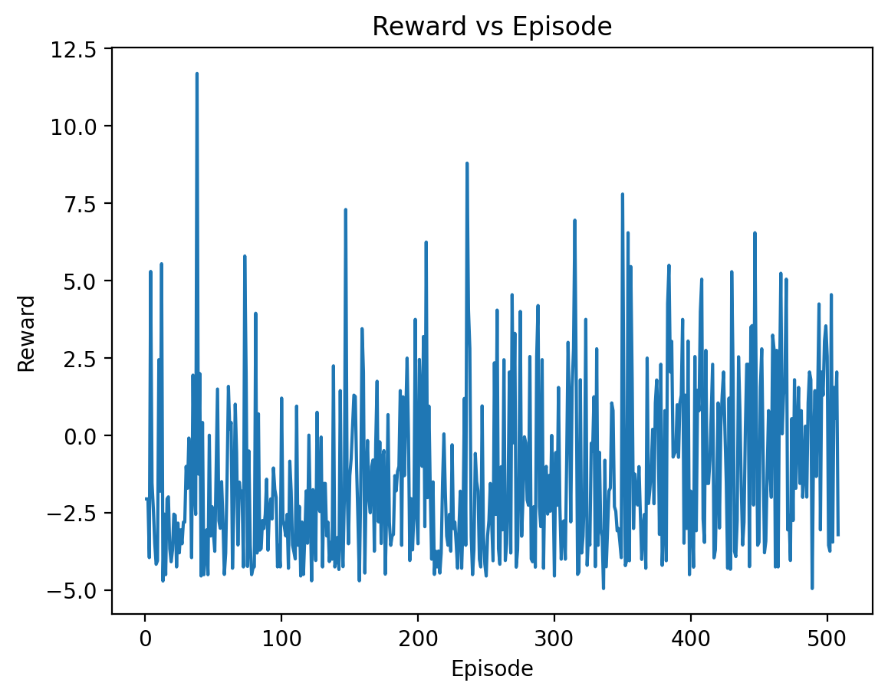

# Applied Reinforcement Learning — Autonomous Driving with PPO  
**Author:** Aleyna Kaysı  

---

##  Evolution of the Agent (Untrained → Half-Trained → Fully Trained)

> The following video demonstrates the learning progression of the agent across three stages:  
> random behavior (untrained), partial skill acquisition (half-trained), and stable driving (fully trained).

**Embedded Evolution Video**


artifacts/videos/evolution.mp4

---

##  Methodology

### 1. Environment
- **Environment:** `highway-v0` (Highway-Env / Gymnasium)  
- **Objective:** Maximize driving speed while avoiding collisions in dense traffic.  
- This represents a **multi-objective optimization problem** balancing performance (speed) and safety.

---

### 2. Reward Function (The Math)

A custom reward function was designed to explicitly guide learning behavior:

\[
R_t = \alpha \cdot \text{speed}_{norm}
+ \beta \cdot \mathbf{1}[\text{right lane}]
- \gamma \cdot \mathbf{1}[\text{collision}]
- \delta \cdot \mathbf{1}[\text{lane change}]
\]

Where:
- \( \text{speed}_{norm} \in [0,1] \) is the normalized vehicle speed.
- \( \mathbf{1}[\text{right lane}] \) rewards stable lane positioning.
- \( \mathbf{1}[\text{collision}] \) penalizes crashes heavily.
- \( \mathbf{1}[\text{lane change}] \) penalizes unnecessary oscillations.

**Coefficients:**
- \( \alpha = 1.0 \)  
- \( \beta = 0.2 \)  
- \( \gamma = 5.0 \)  
- \( \delta = 0.05 \)

**Rationale:**
- A strong collision penalty ensures safety dominates early learning.
- Speed reward encourages efficiency once survival is learned.
- Lane penalties stabilize driving behavior and reduce zigzag motion.

---

### 3. Learning Algorithm (The Model)

- **Algorithm:** Proximal Policy Optimization (PPO)  
- **Implementation:** Stable-Baselines3  
- **Policy Network:** Multilayer Perceptron (MLP)

**Why PPO was selected:**
- Stable policy updates using clipped objective functions.
- Good sample efficiency for continuous control tasks.
- Robust performance in noisy and dynamic environments.

**Main Hyperparameters:**
- Learning Rate: `3e-4`
- Discount Factor (γ): `0.99`
- GAE Lambda: `0.95`
- Clip Range: `0.2`
- Rollout Steps: `2048`
- Batch Size: `64`

---

##  Training Analysis

### 1. Reward vs Episodes



---

### 2. Commentary (Graph Interpretation)

At the beginning of training, the agent performs nearly random actions, leading to frequent collisions and short episodes.  
This is reflected in low and unstable reward values.

As training progresses, the agent gradually learns to avoid collisions and maintain lane stability.  
This leads to longer episodes and smoother reward growth.

After sufficient exploration, the policy begins optimizing for speed while preserving safety constraints.  
The upward trend in rewards indicates successful policy convergence and improved driving efficiency.

---

##  Challenges & Failures

### Problem Encountered
During early experiments, the agent frequently oscillated between lanes and crashed repeatedly.  
This behavior resulted in unstable training and poor reward progression.

### Diagnosis
The default reward signal did not sufficiently discourage:
- Excessive lane switching.
- Risky behavior near other vehicles.

### Solution
A custom reward shaping strategy was introduced:
- Increased collision penalty to prioritize safety.
- Added lane-change penalty to reduce oscillation.
- Added right-lane bonus to stabilize positioning.

After applying these changes, training became significantly more stable and the agent demonstrated visibly improved behavior in the half-trained and final video stages.


##  Reproducibility

### Installation
```bash
pip install -r requirements.txt

### Training
$env:PYTHONPATH="."
python -m src.train

### Video Generation
python -m src.record_stages
python -m src.stitch_video

### Plot Generation
python -m src.plot_training

### Repository Structure
src/
artifacts/
requirements.txt
README.md